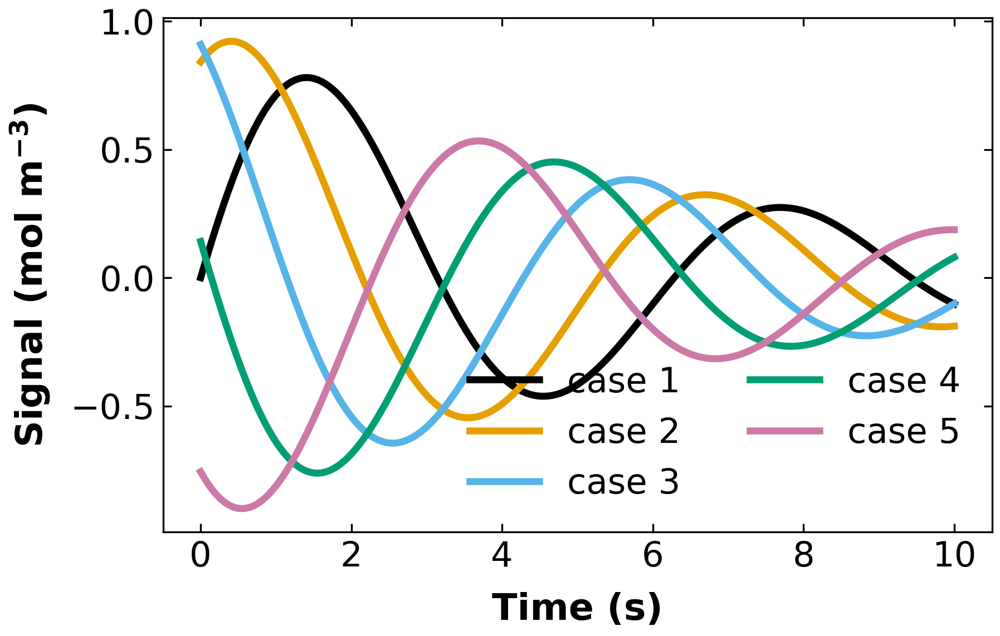

# figure_style

One publication-figure style for a whole project, plus automatic figure provenance.



Drop `figure_style.py` into your project, import it wherever you plot, and stop setting font sizes in analysis scripts.

The point is not tidiness. **Once styling is scattered across dozens of scripts, any later standard becomes unenforceable** — "update every figure to the new guideline" turns into a week of edits instead of a one-line change. Two separate projects learned this the hard way before this module existed.

Implements the [NDCBE publication-quality figure guidelines](https://ndcbe.github.io/data-and-computing/notebooks/01/Publication-Quality-Figures.html).

## Install

Copy `figure_style.py` into your project. Requires `matplotlib`; everything else is the standard library.

```bash
python example.py   # writes example.png, .pdf, .provenance.json, _grayscale.png
```

## Use

```python
import figure_style as fs

fig, ax = fs.figure(fs.SINGLE)
ax.plot(x, y, color=fs.color(0), label="baseline")
ax.plot(x, z, color=fs.color(1), label="corrected")
ax.set_xlabel("Time (s)")
ax.set_ylabel(r"Concentration (mol m$^{-3}$)")
ax.legend()

fs.save_fig(fig, "figures/fig3_concentration", sources=["results/run_07.csv"])
```

That writes `fig3_concentration.png` (300 dpi), `.pdf` (1200 dpi), and `.provenance.json`.

## What the style sets

| | |
|---|---|
| Sizes | `SINGLE` 4×4, `TALL` 4×6.4, `WIDE` 6.4×4, `TWO_PANEL` 8×4 inches |
| Resolution | 300 dpi PNG, 1200 dpi PDF, tight bounding box |
| Lines | width 3, marker size 8 |
| Axis labels | 16 pt bold, 8 pt pad |
| Tick labels | 15 pt, direction `in`, top and right spines ticked |
| Legend | 15 pt, no frame |
| Colour | Okabe-Ito 8-colour palette; `viridis` sequential; `RdBu_r` diverging |
| Fonts | sans-serif, `mathtext` regular |

The palette is colour-blind safe and survives greyscale printing. Use `fs.color(i)` rather than hex literals so a palette change propagates everywhere.

## Provenance

`save_fig` writes a sidecar JSON next to every figure, **on by default**:

```json
{
 "figure": ["example.png", "example.pdf"],
 "created": "2026-09-02T14:45:11-05:00",
 "script": "/path/to/make_figure3.py",
 "size_inches": [6.4, 4.0],
 "sources": ["results/demo.csv"],
 "python": "3.12.7",
 "matplotlib": "3.9.2",
 "git_commit": "898997de0473dcf14900e2375b162bac0d39c26c",
 "git_dirty": true
}
```

This is the link that answers "which run produced this figure?" six months later — see [`../../practices/scientific_figures_tables.md`](../../practices/scientific_figures_tables.md) §5. It defaults to on deliberately: figure provenance is skipped by default everywhere else, and that is exactly why figures become untraceable.

Pass `sources=[...]` with the data files the figure was built from. `git_dirty: true` means the figure was produced from an uncommitted working tree — useful to know before it goes in a paper.

Disable with `provenance=False` for throwaway plots.

## Size checking

`save_fig` warns if the figure is not one of the standard sizes, checking **both** dimensions. Checking only the width is a real bug that has shipped: a figure at the right width and the wrong height passes silently and prints at the wrong scale. Pass `check_size=False` when a non-standard size is deliberate.

## Greyscale check

"Is the figure understandable in greyscale?" is on every figure checklist and is almost never tested. This makes it one line:

```python
fs.grayscale_preview(fig, "figures/fig3_concentration")   # writes ..._grayscale.png
```

## API

| | |
|---|---|
| `apply_style(force=False)` | Apply the rcParams. Called automatically on import. |
| `figure(size=SINGLE, **kw)` | `plt.subplots` at a standard size. Returns `(fig, ax)`. |
| `color(i)` | Palette colour `i`, cycling. |
| `save_fig(fig, path_no_ext, sources=None, formats=("png","pdf"), close=True, check_size=True, provenance=True, notes=None)` | Save + record. Returns paths written. |
| `grayscale_preview(fig, path_no_ext)` | Write a desaturated copy. |
| `PALETTE`, `SEQUENTIAL`, `DIVERGING` | Colour definitions. |
| `SINGLE`, `TALL`, `WIDE`, `TWO_PANEL`, `NAMED_SIZES` | Sizes in inches. |

## Adapting it

This is a starting point, not a rule. Fork it for your project and change the constants — the value is that there is **one** place to change them. If your venue wants 3.5-inch single-column figures or serif fonts, edit `apply_style` and every figure in the project follows.

What to keep if you change everything else: one central module, `save_fig` writing provenance, and both dimensions checked.

## Not included

- Domain-specific plot helpers. Those belong in your project, built on this.
- Colour-contrast validation beyond the palette choice.
- Anything that looks at whether the figure is *good*. That still needs your eyes — assistants are strong on numbers and weak at seeing that a fit is bad or a panel is confusing. See [`../../practices/scientific_figures_tables.md`](../../practices/scientific_figures_tables.md) §9.
