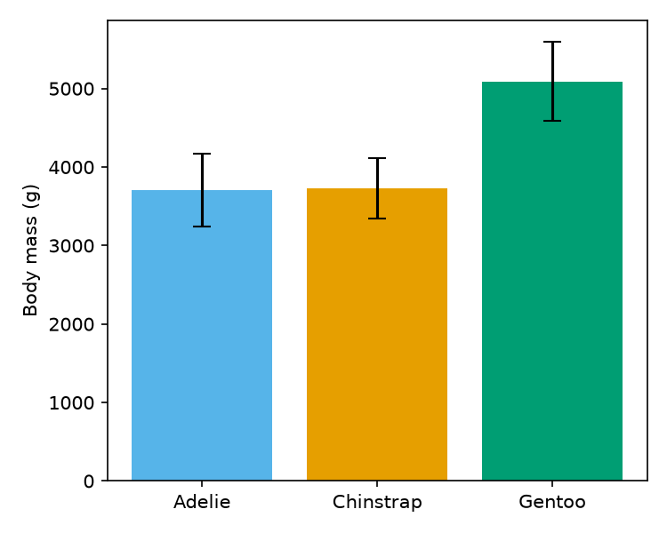

# Body size in three Palmer Archipelago penguin species

*Draft results for group meeting. The analysis is in `notebooks/penguin_analysis.ipynb` and the data are in `data/penguins.csv`.*

## 1. Data and methods

We analysed body measurements of Adelie, Chinstrap, and Gentoo penguins sampled at Palmer Station, Antarctica, in 2007–2009 (Gorman et al., 2014; data distributed by Horst et al., 2020). The file lists 344 penguins with bill length, bill depth, flipper length, body mass, sex, island, and sampling year. Every penguin has a complete set of measurements, so all 344 were used in the analyses below.

Groups were compared with two-sample t-tests and 95% confidence intervals unless stated otherwise. All tests are two-sided with α = 0.05.

## 2. Species differ in body mass

Mean body mass was 3,706 g for Adelie (n = 146), 3,733 g for Chinstrap (n = 68), and 5,092 g for Gentoo (n = 119) penguins. Gentoo penguins were therefore about 27% heavier than Adelie penguins. Adelie and Chinstrap penguins did not differ detectably in body mass (Welch's t-test, p = 0.65). This p-value means there is a 65% probability that the two species have the same true mean body mass.

## 3. Flipper length differs between Adelie and Chinstrap penguins

Flipper length was compared between Adelie (n = 146) and Chinstrap (n = 68) penguins with Welch's t-test, which does not assume equal variances. Shapiro–Wilk tests were not significant in either group (p = 0.74 and p = 0.81), confirming that flipper length is normally distributed in both species. Chinstrap penguins had longer flippers on average (mean difference 5.7 mm; t(212) = −5.80, p = 2.4 × 10⁻⁸). The 95% confidence interval for the difference was −7.7 to −3.8 mm, meaning that 95% of Chinstrap penguins have flippers 3.8 to 7.7 mm longer than the average Adelie penguin. The extremely small p-value shows that this difference in flipper length is enormous.

Gentoo flipper lengths departed from normality (Shapiro–Wilk p = 0.002), so Chinstrap and Gentoo penguins were compared with a Mann–Whitney U test (p < 0.001).

## 4. Sex differences in Adelie body mass

Adelie males were 675 g heavier than females on average (Welch's t-test, p < 0.001). We are 95% confident that the true difference in mean body mass is between 573 and 776 g.

## 5. Island effects

We also asked whether Adelie penguins differ among the three islands. Adelie penguins on Torgersen Island had significantly longer flippers than those on Biscoe Island (mean difference 2.7 mm, p = 0.047), suggesting that conditions on Torgersen promote longer flippers.

Across all species, mean body mass was 4,719 g on Biscoe, 3,719 g on Dream, and 3,709 g on Torgersen Island (one-way ANOVA, p < 10⁻³⁵). Penguins on Biscoe Island are therefore about 1,000 g heavier than penguins elsewhere, which indicates that Biscoe's environment promotes larger body size.

## 6. Bill shape

Bill length and bill depth were negatively correlated (Pearson r = −0.23, p < 0.001, n = 333). Penguins with longer bills therefore tend to have shallower bills, and this holds within the species studied here.

## 7. Figure

**Figure 1.** Mean body mass by species. Bars show means and error bars show 95% confidence intervals.

## 8. Conclusions

- The three species differ clearly in size, and Gentoo penguins are the largest.
- Adelie and Chinstrap penguins differ in flipper length but not in body mass.
- Island conditions affect Adelie flipper length and penguin body mass.
- Bill shape shows a trade-off: penguins with longer bills have shallower bills.

## References

Gorman KB, Williams TD, Fraser WR (2014). Ecological sexual dimorphism and environmental variability within a community of Antarctic penguins (genus *Pygoscelis*). *PLoS ONE* 9(3): e90081.

Horst AM, Hill AP, Gorman KB (2020). palmerpenguins: Palmer Archipelago (Antarctica) penguin data. R package version 0.1.0.
